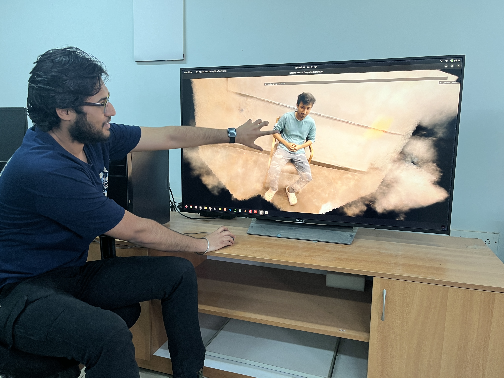

<!DOCTYPE html>
<html lang="en">
<head>
    <meta charset="UTF-8">
    <meta name="viewport" content="width=device-width, initial-scale=1.0">
    <title>Your Website</title>
    
</head>

<section>
    <h2>Section Content</h2>
    
This is the content of the section.

</section>

</body>
<head>
    <meta charset="UTF-8">
    <meta name="viewport" content="width=device-width, initial-scale=1.0">
    <title>Four Quadrant Layout</title>
    
</head>
<body>

    

        <!-- Placeholder for photo -->
        
    

    

        <!-- Multiple lines of text -->
        <h1 class="name-heading">Kapil Choudhary</h1>
        
Lorem ipsum dolor sit amet, consectetur adipiscing elit. Sed eget metus nec massa interdum eleifend. Nulla facilisi. Integer bibendum nisl ut urna ullamcorper aliquet.

        
Phasellus tempus mattis elit, a consectetur velit fermentum nec. Fusce eu mi quis ligula laoreet tincidunt. Nam accumsan ligula ut velit ultricies scelerisque.

    

    

    

</body>

</html>
